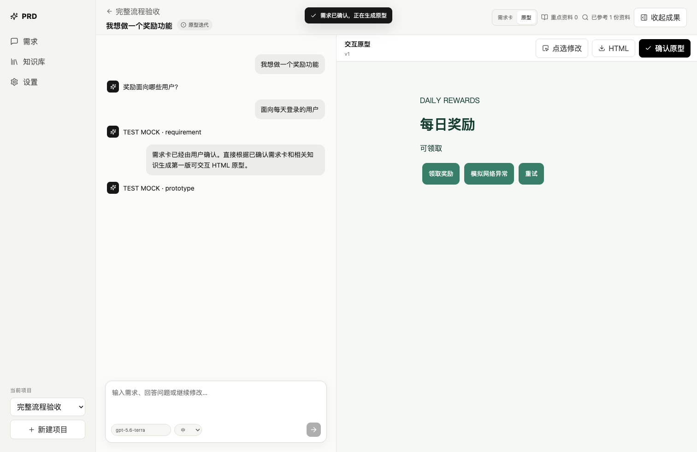
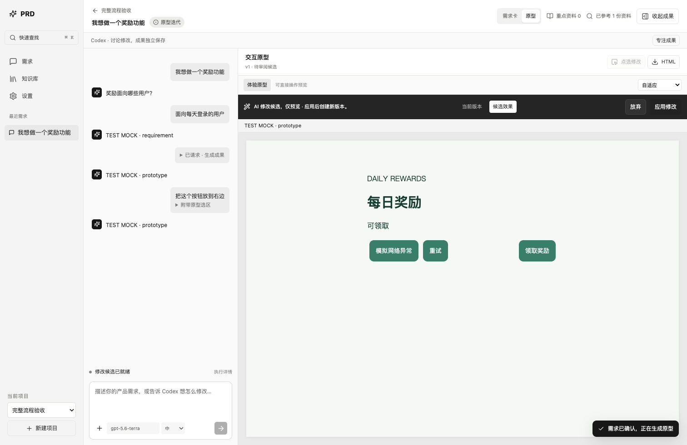
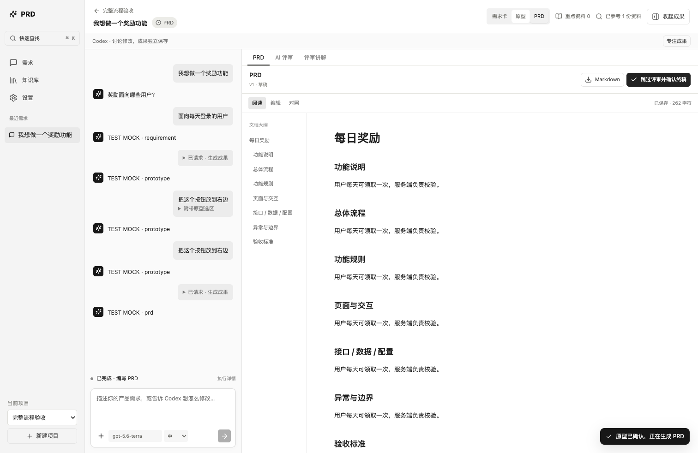
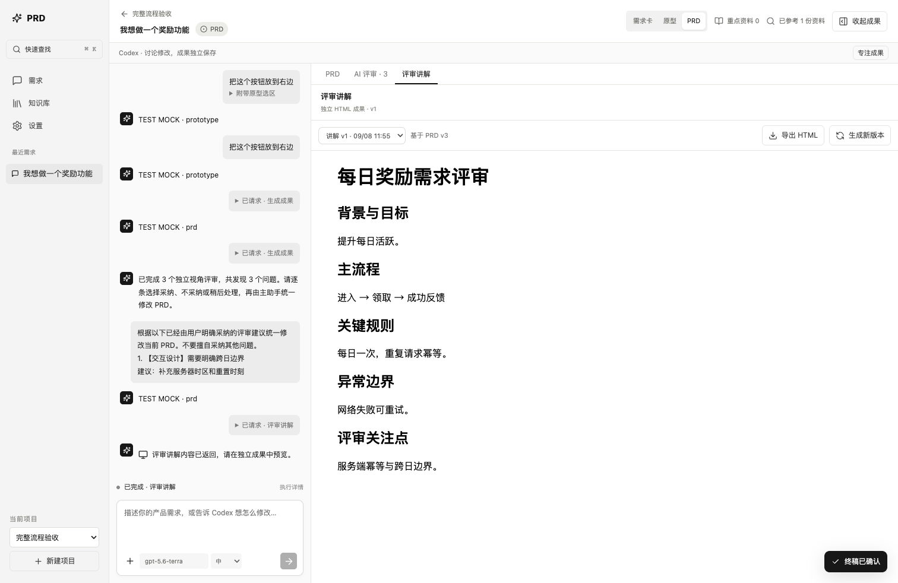
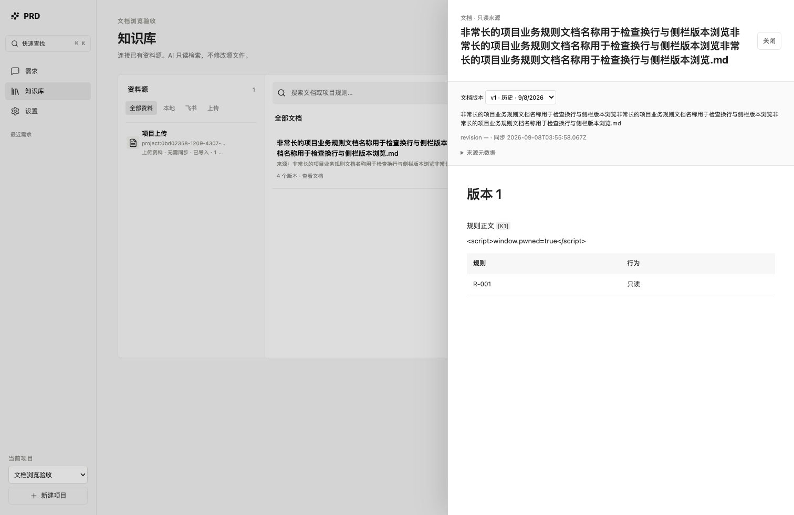
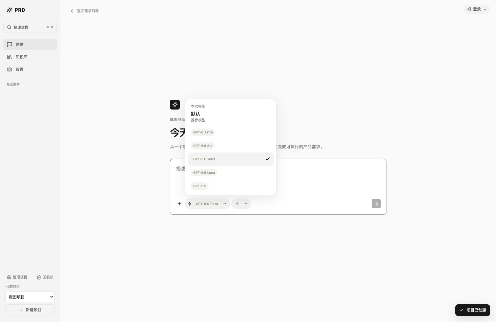
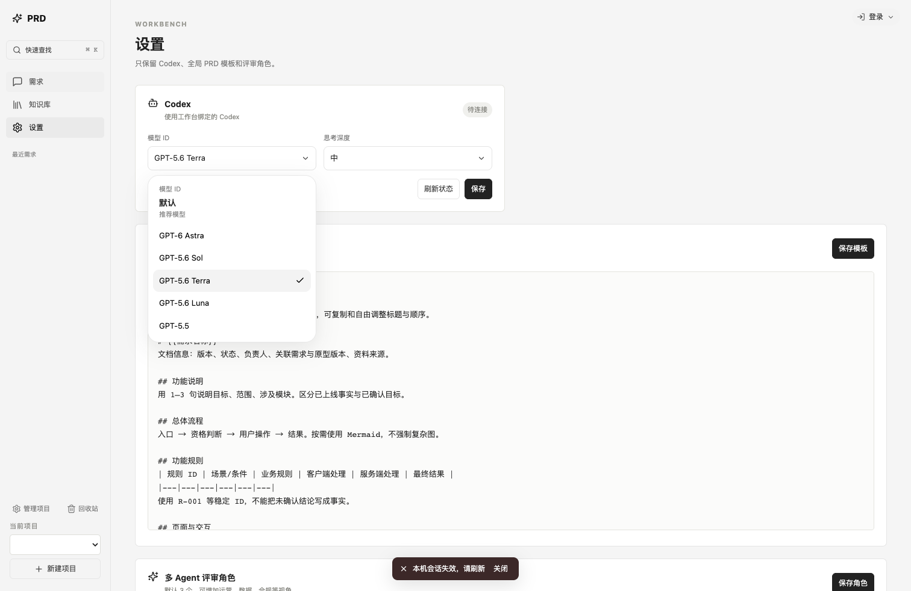
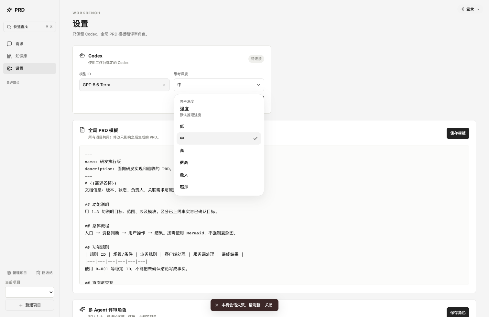
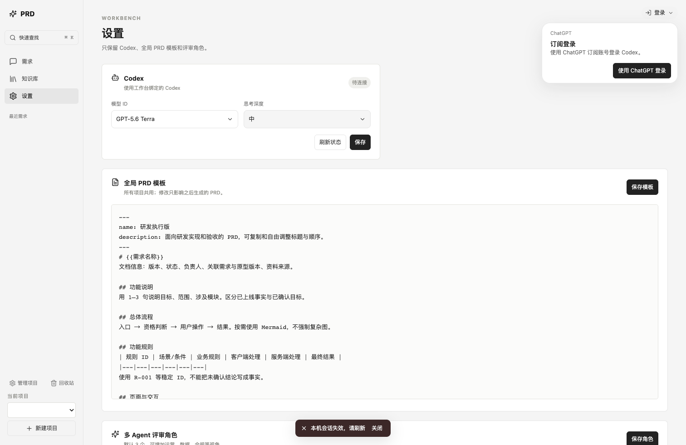

# Product Agent Workspace 前端重设计

## 1. UX Audit

审计先读取真实实现与调用方，再用本机 Chrome + 临时 SQLite + MockRuntime/MockLark 跑原版完整流程。原版 6 条浏览器测试通过后，保存 `docs/ux/before-*.png`，实际观察原型和 PRD 截图后才修改 UI。

- **P0**：窄屏成果以绝对定位覆盖对话；点选后需要跨栏输入；候选浮条覆盖原型；执行状态缺少统一停止/重试入口；生成指令和选区坐标占用聊天正文。
- **P1**：需求卡与 PRD 只有大文本框；已确认状态不明显；讲解沿用 PRD 标题与操作；知识没有来源筛选与文档侧栏；引用只有元数据，无法预览冻结版本。
- **P2**：缺少快速查找、专注模式和一致焦点；长文档缺少大纲；无结果搜索错误地回退显示所有资料；未保存编辑在切换成果时丢失。

## 2. Chosen Interaction Model

采用渐进双区工作台。无成果时只显示对话；成果出现后自动展开为较窄的 Codex 对话与较宽的当前成果；支持「专注成果」「显示对话」和「收起成果」。桌面优先保障原型/文档空间，小屏改为可滚动的上下区域，不再覆盖对话。

对话承载讨论和操作回执；正式成果、版本和确认始终在独立区域。自动生成指令保留原始记录，但默认折叠。Show Me 的 HTML 不再刷入聊天正文，使用独立标题、版本、预览和导出。

## 3. Rejected Directions

- 固定 IDE 四栏：让低频来源、历史和 Inspector 长期抢占内容空间。
- 纯对话 + 临时成果抽屉：原型与长文档需要稳定、持续的编辑空间。
- 大型富文本编辑器：增加依赖和文档格式转换风险；选择安全文本渲染和 Markdown 源文编辑。
- 自动解析 AI 选项并直接产生决策状态：现有问题为自由文本，不引入第二套业务决策系统。以当前待回答问题数和原始问题引导用户，通过既有 conversation 回答。

## 4. Final Information Architecture

```text
项目切换 / 快速查找 Cmd/Ctrl+K
├─ 需求列表 / 最近需求
│  └─ 新需求：Prompt + 附件 + Model + Reasoning
│     └─ Workspace
│        ├─ Conversation
│        │  ├─ 当前决策 / 讨论 / 操作回执
│        │  ├─ Execution status → 详情 → Recall Debug
│        │  └─ Composer / Stop / Retry
│        └─ Artifacts（随成果逐步出现）
│           ├─ Requirement：阅读 / 编辑 / 对照 / 历史 / 确认
│           ├─ Prototype：体验 / Inspect / 就地修改
│           │  └─ Current ↔ Candidate → Apply / Discard
│           └─ PRD 成果组
│              ├─ PRD：大纲 / 编辑 / 对照 / 终稿 / 交付
│              ├─ Review Inbox：逐项裁决 / 应用采纳
│              └─ Presentation：独立预览 / 版本 / HTML 导出
├─ Knowledge：来源筛选 → 文档 → 只读版本侧栏
└─ Settings：Codex 默认模型与思考深度 / Template / Review Roles
   右上角：ChatGPT 订阅登录
```

## 5. Core Interaction Changes

| 区域 | 变化 |
| --- | --- |
| New Requirement | 「今天要设计什么？」居中输入区；不显示空成果；附件在提交时进入当前需求参考资料。 |
| Conversation | 保留原始对话与生成记录；自动生成指令、选区坐标折叠；HTML 成果改为回执；显示当前待回答决策数。 |
| Artifact | 草稿、确认、终稿、待同步文案；历史只读预览；恢复仍创建新版本；有未保存内容时禁止确认。 |
| Prototype | 独立预览工具栏；自适应/390px；Hover highlight、点选后自动聚焦就地输入；Escape 清除；保留 iframe 隔离。 |
| Candidate | 独立静态审阅条；当前/候选切换；变化摘要；应用、放弃；Cmd/Ctrl+Enter 只在当前原型候选视图应用。 |
| PRD | 安全 Markdown 阅读、大纲、编辑/对照、保存状态、上一版本新增/修改行摘要；没有新增富文本依赖。 |
| Review | 独立收件箱标题；严重程度计数、来源角色、版本关联；沿用最新裁决筛选采纳项；无采纳时禁用应用。 |
| Knowledge | Local/Feishu/Upload/具体 Source 筛选；空搜索真实为空；长标题收敛；侧栏读取指定版本正文、表格与来源元数据。 |
| Citation | Hover/键盘 Focus 显示来源；人工修订与恢复沿父版本查找冻结引用；只读取冻结 knowledgeId，不替换成最新文档。 |
| Execution | 就绪、等待执行、运行、等待回答、完成、失败、停止、中断和重试；详情展开原始事件，Debug 单独折叠。 |
| Model / Login | 模型与思考深度使用自定义列表；ChatGPT 登录在主界面右上角，不在设置卡内。 |

未保存草稿使用浏览器 localStorage 做本地恢复，按 requirementId、artifactKind、baseVersionId 隔离。编辑后 debounce 700ms 写入，页面隐藏或离开时补写。重新进入时明确选择恢复或放弃；基础版本变化时只能查看旧草稿或放弃，不能自动覆盖当前版本。正式保存仍调用原版本 API，保存成功后清除对应备份。

## 6. Visual System

- Typography：系统无衬线；正文 12–14px，文档标题 25px，页面标题 25–30px；源码等宽字体。
- Spacing：4/8/12/16/24/32px 为主要节奏；桌面导航 184px，对话 300–390px，其余空间给成果。
- Color：黑白灰为主，文本 `#202020`，次要文字 `#727272`，边界 `#e5e5e5`，画布 `#f5f5f5`；失败仅少量暗红语义。
- Radius：控件 4–6px，Composer 9–10px，弹窗 8–9px；没有渐变、玻璃与发光。
- Surface：导航、对话、画布轻微明度差；正式文档白色；边界以区域分隔为主。
- States：Hover 背景、2px 可见 Focus、Selected 灰底、Disabled 降低透明度；运行脉冲支持 reduced-motion。

## 7. 修改文件

| 文件 | 职责 |
| --- | --- |
| `web/main-v2.tsx` | 工作区、导航、Composer、Inspect/Candidate、Review/Show Me、Knowledge 筛选与新组件接线。 |
| `web/components/ListSelect.tsx` | 模型与思考深度的自定义列表。 |
| `web/components/AccountMenu.tsx` | 主界面右上角订阅登录。 |
| `web/workspace.css` | 新工作台设计 token、布局、状态、文档、弹窗和响应式；覆盖现有基础样式，兼容旧组件。 |
| `web/components/DocumentEditor.tsx` | 安全文档渲染、大纲、编辑/对照、版本差异摘要、冻结引用预览。 |
| `web/components/ExecutionStatus.tsx` | 统一任务状态、停止/重试、事件详情与 Recall Debug。 |
| `web/components/CommandMenu.tsx` | 原生模态命令菜单、键盘选择与焦点恢复。 |
| `web/components/KnowledgeDocument.tsx` | 按版本读取文档的只读侧栏。 |
| `web/components/useArtifactDraft.ts` | UI 草稿缓存与基础版本冲突保护。 |
| `server/app.ts` | 仅新增指定知识版本的只读正文查询；接收 UTF-8 上传显示名称元数据，修复中文附件名称。 |
| `tests/workbench.spec.ts` | 保留原有流程与权限断言；更新新 DOM 操作，追加响应式、历史、引用、草稿、附件、IME、执行状态测试与截图。 |
| `tests/browser-server.ts` | 测试专用 slow/failure Mock 输入，用于真实停止/重试流程。 |
| `README.md` / `CHANGELOG.md` / `docs/architecture.md` / `docs/verification.md` | 同步交互说明、只读 API、验证边界。 |
| `docs/ux-redesign.md` / `docs/ux/*.png` | 本报告与前后浏览器证据。 |

`server/domain.ts`、`conversation.ts`、`tasks.ts`、Context Orchestrator、Agent prompts 与默认 Skill 契约均未改变。

## 8. Browser Verification

真实 Google Chrome，Playwright 控制，临时 Mock 服务监听 loopback，临时 SQLite 位于系统 tmpdir。没有调用真实模型或发布真实飞书。原版完整链路通过后才实施。

验证：新建 → Grilling → 需求卡编辑/确认 → 原型 → Hover/Inspect → 就地候选 → Current/Candidate → 快捷 Apply → 历史预览/Restore → Discard → 原型确认 → PRD 编辑保存 → 三角色 Review → 逐条采纳/不采纳/稍后 → 仅应用采纳 → 终稿血缘 → Show Me 预览/版本/导出/过期提示 → 飞书显式 prepare/confirm Mock。

补充：Source 同步、缺失文档停用、搜索空结果、知识版本侧栏、恶意 HTML 作为文本展示、附件冻结引用、IME Enter/Shift+Enter、Command Menu、焦点、停止与失败重试、45 节长文档、大量引用与 13 项历史选项、草稿跨面板恢复与并发 head 更新保护。

响应式检查宽度 1512、1280、900、600、390；检查文档级横向溢出、成果操作可见、对话和 Composer 能滚动访问。侧栏与历史弹窗使用原生 dialog 焦点约束。测试截图保存在 `test-results`，精选证据复制到 `docs/ux`。

## 9. Test Result

最终结果见 `docs/verification.md`，包含环境参数与实际测试计数。

## 10. Remaining Issues

- 真实 ChatGPT 订阅调用、真实飞书源同步与发布待配置/待实测；Mock 通过不代表在线服务已验收。
- Markdown renderer 支持标题、基本列表、表格、引用、代码和 K 引用；不是完整 CommonMark/GFM 富文本引擎，复杂嵌套或嵌入 HTML 会保留为安全文本。
- 版本差异摘要显示新增/修改行与字符变化（最多 60 行），不提供逐字符/删除行 diff。
- 本地草稿不属于正式版本，也不跨浏览器同步；存储不可用时提示备份失败。浏览器清理数据会移除备份，崩溃可能丢失最后 700ms 的输入。
- Grilling 仍使用现有自由文本问题与 conversation 提交；没有对任意模型输出猜测可点击答案。
- Show Me 保留当前 PRD 成果组入口，但拥有独立标题、版本预览和导出；没有另建业务状态。

## 浏览器截图

以下均为真实 Chrome + 明确 Mock 数据，不代表在线模型的生成质量。

原版原型工作区：



新版原型候选审阅：



新版 PRD 阅读：



独立评审讲解：



知识版本侧栏：



自定义模型列表与右上角登录：









### 持续回归基线

GitHub CI 在单元测试和构建后使用系统 Chrome 运行 `@smoke`：新需求 → 需求卡 → 确认 → 原型 → 候选 → 应用 → PRD。完整浏览器测试继续供本地回归，模型与发布均为 Mock。后续 UI 改动应保持本文的交互设计原则。

### 可拖动左右分栏

桌面端导航、对话与成果、文档大纲与正文、编辑与预览、知识来源与文档，以及知识文档侧栏支持拖动调宽。悬停分隔线显示反馈，双击恢复默认，方向键以 10px 调整（Shift 为 40px）。宽度按布局类型保存在当前浏览器；设置最小宽度与可用空间约束，窄屏使用原响应式布局。布局偏好不改变业务数据。
